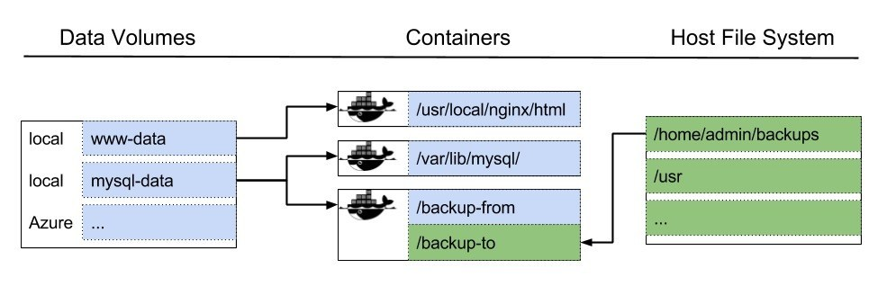

# What Data Analysts Need to Know About Docker

https://www.weave.works/blog/a-practical-guide-to-choosing-between-docker-containers-and-vms

## What is Docker?

Docker uses *containers*. Containers contain just enough linux utilities and associated code to run that code on any machine. Some of them contain command line utilities, some of them can contain web servers/IDEs, some have databases. These containers are managed by *Docker Daemon*, a service that runs on a machine.

They contain a limited file system that is isolated from your system, but you can connect other parts of your file system to them with *Volumes*.

> Docker lets you package software and its dependencies in a way that when you run it, the same output can be reproduced across any machine that runs Docker, regardless of OS/processor architecture.

## What problems are Docker meant to Solve?

> The key benefit of Docker is that it allows users to **package an application with all of its dependencies into a standardized unit** for software development. - https://docker-curriculum.com/#what-is-docker-

- **Reproducibility** - Can precisely specify which versions of packages and software to use, so you can *replicate analysis in a reproducible manner*.
- **Containers are OS independent** - can run a docker container on Linux, Mac OS, Windows and it will work
- **Containers are lightweight** - require much less system overhead and resources
- **Software administration** - containers are independent of each other (very good for system administrators)
    - Gives you granular control over the software
    - Can take down one service without affecting the others

## What software is containerized?

Almost all Bioinformatics Software and Web Stacks!

- RStudio Connect - very fast to spin up an instance of AWS (15 minutes)
- rocker project - contains RStudio and R Dependencies for specific kinds of analyses: https://www.rocker-project.org/
- Bioconductor: https://www.bioconductor.org/help/docker/
- GATK - https://gatk.broadinstitute.org/hc/en-us/articles/360035889991--How-to-Run-GATK-in-a-Docker-container
- Web Stacks (web server/scripting software/database system) - https://github.com/hanafiah/docker-webstack
- Databases - https://docs.docker.com/engine/examples/postgresql_service/

## Terminology

- **Images** - The blueprints of our application which form the basis of containers.
- **Containers** - Created from Docker images and run the actual application. We create a container using `docker run` based on an image. A list of running containers can be seen using the `docker ps` command. When a container is stopped using `docker stop`, all files in it fail to persist.
- **Docker Daemon** - The background service running on the host that manages building, running and distributing Docker containers. The daemon is the process that runs in the operating system which clients talk to.
- **Docker Client** - The command line tool that allows the user to interact with the daemon. More generally, there can be other forms of clients too - such as Kitematic which provide a GUI to the users.
- **Docker Hub** - A registry of Docker images. You can think of the registry as a directory of all available Docker images. If required, one can host their own Docker registries and can use them for pulling images.
- **Volume** - A File Directory that persists beyond a container.
- **Docker Compose** - utility that lets you connect multiple containers with a volume and with each other. 
- **Kubernetes** - utility that lets you run Docker (and other container systems) on a HPC cluster. Handles distributing an application over an allocation.

Some of these definitions were adapted from: https://docker-curriculum.com/

## Containers versus images

A **Docker Image** is a collection of software and its dependencies that can be pulled from DockerHub or another Registry. It is *read only* - you cannot modify the contents.

A **Docker Container** is an instance of the image running on a machine. 

Multiple containers can be run from a single docker image, and these containers will be independent of each other.

More information here: https://phoenixnap.com/kb/docker-image-vs-container

## Drawbacks to Docker

Docker requires **system-level access** to your machine (the equivalent of root access), so you can't install it by yourself on a remote machine where you don't have access privileges. You'll need to ask adminstration to install Docker and add you to the `docker` group. 

**Everything inside a container disappears when you finish running the container**. That means that files that you add to a container will disappear after you run them. You fix this by mounting **Volumes** to your container. 

## Docker Volumes

https://codeblog.dotsandbrackets.com/persistent-data-docker-volumes/

Volumes let you use files and folders outside of the built in container file system. 

## Broad Institute GATK Docker Image

For more information about the Docker container:

https://hub.docker.com/r/broadinstitute/gatk

# Acknowledgements

- https://docker-curriculum.com/
- https://biodata-club.github.io/talks/repro_paper.pdf
